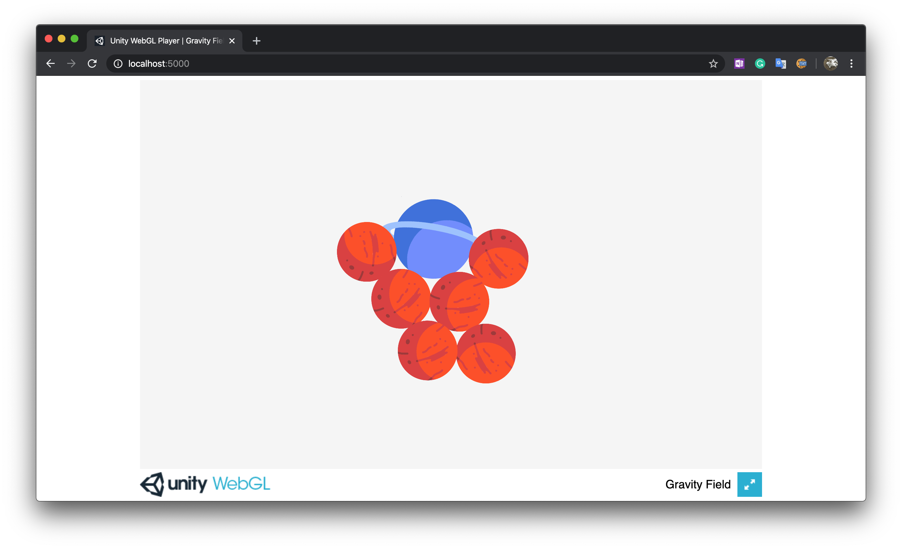

# Unity Gravity Field Demo

- Inspired by
  [How to Simulate Gravity in Unity](https://www.youtube.com/watch?v=Ouu3D_VHx9o)
- Hosted at
  [https://zehua-chen.github.io/unity-gravity-field/](https://zehua-chen.github.io/unity-gravity-field/)

## Mentions

### Sprites

- [Mars SVG](https://www.svgrepo.com/svg/4062/mars),
  [LICENSE](https://creativecommons.org/licenses/by/4.0/)
- [Uranus SVG](https://www.svgrepo.com/svg/168565/uranus),
  [LICENSE](https://creativecommons.org/licenses/by/4.0/)
